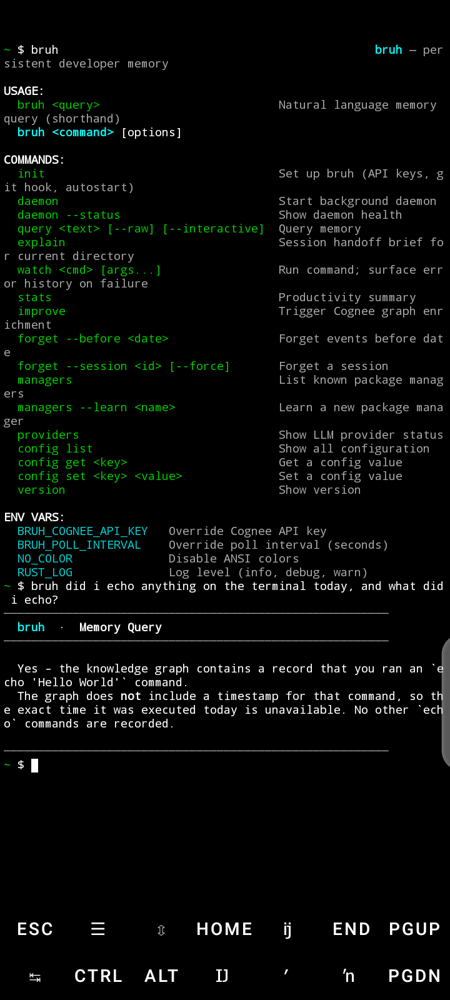
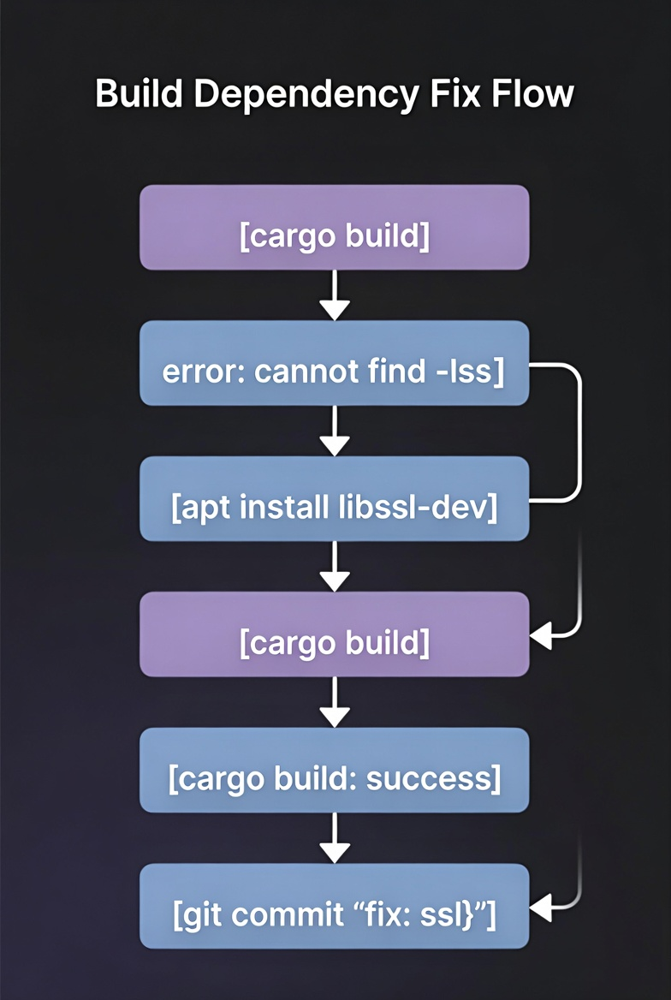
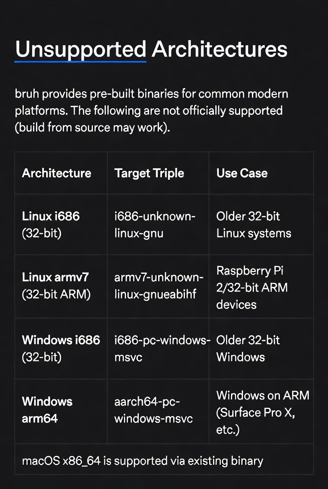
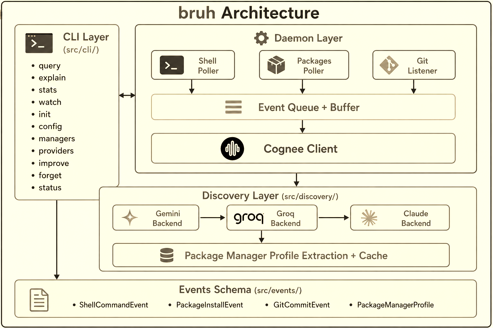

> ...because your terminal shouldn't have amnesia.


**Given an unknown package manager, can we infer enough semantics to interact with it?**

**If developer context is more casual than semantic, what's the maximum amount of semantics we can recover from it?**

That's where bruh comes in.

bruh is a background daemon + CLI that ingests your shell history, package installs, git commits, and errors into [Cognee](https://github.com/topoteretes/cognee)'s hybrid graph-vector memory layer, then lets you query all of it in natural language, from any terminal session, forever.


Sunday 5th July, 2026; we finally got a smooth prompt and proof of concept.


---

## The problem

Every developer has lived this:
- You fixed a cryptic build error three weeks ago. You have no idea what you did.
- You installed a package and cannot remember why.
- You return to a project after a break and spend an hour just reconstructing context.

Shell history is flat. Git logs capture commits, not the struggle that led to the commit. Package managers record installs, not what led to their installation. **Nothing connects these events into a causal, queryable narrative but guess what?**

bruh connects them.

```
$ bruh "what did I do to fix that linker error"

────────────────────────────────────────────────
  bruh  ·  Memory Query
────────────────────────────────────────────────

  Session: Thu Jul 01 · 14:31–14:47

  14:31:18  cargo build                         [1]
            error: linker 'cc' not found
  14:32:05  sudo apt install gcc build-essential [0]
  14:32:58  cargo build                         [0]
  14:33:14  git commit "fix: add gcc for linking"

────────────────────────────────────────────────
```

---

## Why Cognee specifically

Going through github, most tools that use Cognee treat it as a vector database to embed text and find similar text. **bruh does not do this.**

When you ask "why did I install openssl?", you do not want the document most similar to the word "openssl". You want the causal chain:



This is a **graph traversal**, not vector similarity. Cognee's hybrid graph-vector layer makes it possible.

Without the graph, the causal chain reconstruction that powers bruh's core demo moment cannot exist.

---

## Platform Support

| Platform | Status |
|----------|--------|
| Linux (x86_64, arm64) | ✅ Full support |
| macOS (arm64, Intel) | ✅ Full support |
| Windows 10/11 | ✅ Full support |
| Termux (Android aarch64) | ✅ Full support |



**Note**: 32-bit and less common architectures are not provided with official binaries.

Always wrap your query in double quotes (`bruh "what did I break yesterday"`), otherwise your shell will split it into separate words before bruh ever sees it, and any special characters in it (`!`, `*`, `?`, `$`, and friends) may get interpreted by the shell instead of reaching your query.
---

## Installation

### Linux / macOS / Termux

```bash
curl -sSL https://raw.githubusercontent.com/oboobotenefiok/bruh/main/install.sh | sh
```

### Windows (PowerShell)

```powershell
irm https://raw.githubusercontent.com/oboobotenefiok/bruh/main/install.ps1 | iex
```

### Build from source (all platforms)

```bash
git clone https://github.com/oboobotenefiok/bruh
cd bruh
cargo build --release
./target/release/bruh init
```

---

## Quick start

```bash
bruh init           # configure API key, install git hook, set up autostart
bruh daemon &       # start background memory collection
# ... work normally for a while ...
bruh "what did I just install and why"
bruh explain        # get a handoff brief for your current project
bruh stats          # productivity summary
```

---

## Commands

| Command | Description |
|---|---|
| `bruh "<query>"` | Natural language memory query (shorthand) |
| `bruh init [--force]` | Configure bruh; `--force` reinstalls git hook |
| `bruh daemon` | Start background daemon |
| `bruh daemon --status` | Show daemon health |
| `bruh query <text> [--raw] [--interactive]` | Query memory |
| `bruh explain` | Session handoff brief for current directory |
| `bruh watch <cmd>` | Run command; surface error history on failure |
| `bruh stats` | Productivity summary |
| `bruh improve` | Trigger Cognee graph enrichment |
| `bruh forget --before <date>` | Forget old events |
| `bruh forget --session <id> [--force]` | Forget a session |
| `bruh managers` | List known package managers |
| `bruh managers --learn <name>` | Discover a new package manager |
| `bruh providers` | Show LLM provider cascade status |
| `bruh config list\|get\|set` | Manage configuration |

---

Before I continue with my favourite feature in this project, Here is a "linked-list" of my daily log on X(Formerly Twitter) from day one to seven:

1. https://x.com/oboobotenefiok/status/2071590967530950771
2. https://x.com/oboobotenefiok/status/2071894339786027456
3. https://x.com/oboobotenefiok/status/2072295865062949350
4. https://x.com/oboobotenefiok/status/2072626138451489084
5. https://x.com/oboobotenefiok/status/2073073927153209503
6. https://x.com/oboobotenefiok/status/2073492659486798322
7. https://x.com/oboobotenefiok/status/2073860582097175013

Now, here is a feature that wasn't on my mind in the very early process of the planning but came up as a question midway:

## The self-learning discovery portal (My Favourite)

bruh detects when you use an unknown package manager in your shell history. It then:

1. Sends the manager name straight to an LLM cascade (Gemini → Groq → Claude), asking it to use what it already knows rather than searching the web, an earlier version of this tried a DuckDuckGo search step first, but it added latency and a failure mode without adding real accuracy, the models already know this stuff from training
2. Extracts the install verb, registry path, log path, and confidence score
3. Stores the profile in Cognee and caches it locally

```
$ bruh managers --learn pnpm

  Running LLM extraction cascade:
    Trying gemini…  ✓ (High confidence)

  Result: Extracted profile:
    install verb:   add
    remove verb:    remove
    list command:   list
    registry:       ~/.pnpm-store
    confidence:     High

  Storing in Cognee graph…  ✓
  Caching locally…          ✓
```

---

## Architecture



**Why NDJSON instead of SQLite for the offline buffer?**
It allows for zero native compilation and linking complexity, while being human-readable for debugging, append-friendly, and `serde_json` is already in the dependency tree. The buffer does not need query capability, it just needs append and replay.

**Why `rustls-tls` instead of OpenSSL?**
Pure Rust TLS means zero system library dependencies. This is critical for Termux (Android) where OpenSSL linking is a common failure mode. Actually, I'm building this project on Termux(Mobile) so I think a lot about compilation and runtime complexities.

**Why polling instead of `inotify`/`kqueue`?**
Polling is portable (Linux, macOS, Windows, Termux) and simpler to implement correctly within a hackathon window. The 30-second poll interval is imperceptible for the use case.

---

## Configuration

```bash
bruh config list                           # show all settings
bruh config set cognee_api_key <key>       # set Cognee key
bruh config set llm_priority gemini,groq   # change provider order
bruh config set poll_interval_seconds 60   # adjust poll cadence
```

All settings can also be overridden with environment variables:

| Variable | Effect |
|---|---|
| `BRUH_COGNEE_API_KEY` | Override Cognee API key |
| `BRUH_POLL_INTERVAL` | Poll interval in seconds |
| `BRUH_FLUSH_INTERVAL` | Flush interval in seconds |
| `NO_COLOR` | Disable ANSI colours |
| `RUST_LOG` | Log level (`info`, `debug`, `warn`) |

---

## Hackathon

This project is built during and for the **WeMakeDevs × Cognee Hackathon** (June 29 – July 5, 2026).
Theme: *"The Hangover Part AI: Where's My Context?"*

---

## License

Visit [MIT](LICENSE-MIT) && [APACHE](LICENSE-APACHE)

## Contributing

Visit [CONTRIBUTING.md](CONTRIBUTING.md)

# ACKNOWLEDGEMENT

Thanks to the [Rust Community](https://rust-lang.org/) for providing excellent tools for building at all levels.

And very special thanks to YOU for paying attention this project.

With Love,

- Obot
